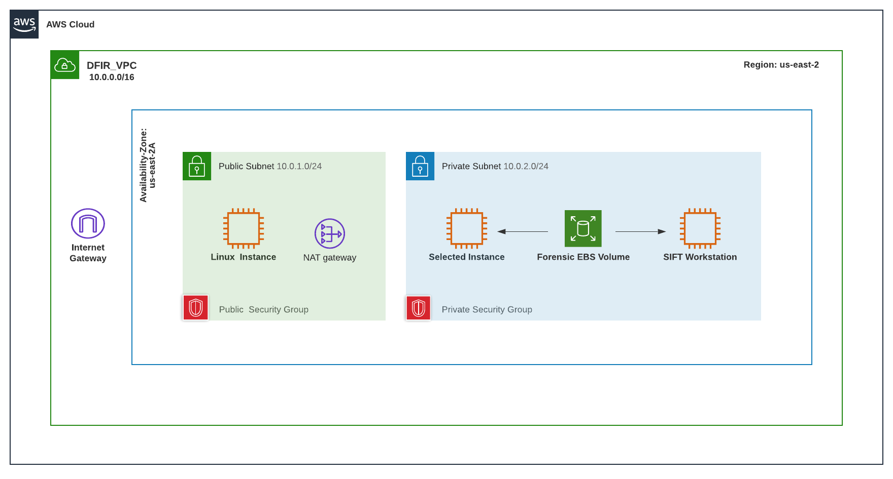
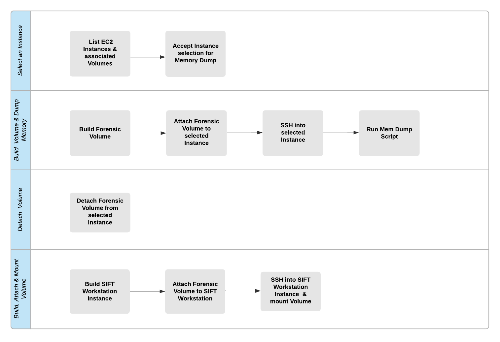

# Linux Memory Dump Automation in AWS
A Python / Boto3 Script that leverages a Forensic Volume to store a LiME memory dump from a selected Instance and attach/mount it to a SIFT Workstation  

---------------------------------------------------------------------------------------------------------------------

### AWS VPC Network Topology:

----------------------------------------------------------------------------------------------------------------------

### Flow of Automation:

----------------------------------------------------------------------------------------------------------------------

### Procedure

#### Step 1: Set AWS configurations:
These environment variables specified here are detected by the AWS CLI and AWS SDKs to utilize a particular region and IAM credentials for future API calls made. 

#### Step 2: Create VPC Resource
A dedicated virtual network that allows customized resources to be specifically allocated to it. Much like a traditional on-premises network, however, its remote and the infrastructure is highly scalable.

#### Step 1: List EC2 Instances and associated Volumes
This will show the instances running in AWS, with specific values present like tag names to uniquely identify instances. Additionally, Public and Private IP addresses, Subnet ID and AMI ID are listed. Lastly, the function also includes Block Devices or Volumes that are mapped to each instance. 

#### Step 2: Accept Instance selection for Memory Dump
For each listed Instance outputted from the previous function, relevant information can be visualized from terminal. The script will prompt for Instance ID and Instance IP input and then save these inputs as variables to be used in the following steps.  

#### Step 3: Build a Forensic Volume
The Forensic Volume is a messenger used to temporarily store the Memory Dump.  It is built in order to attach and detach from selected instances while carrying the Memory Dump data. See below steps for further Information.

#### Step 4: Attach Forensic Volume to selected Instance
After the Forensic Volume is created, it’s status is ‘available’ and therefore, it can be attached to an existing Instance in the same availability zone that the volume was built in. Listing available block devices on the selected Instance that this Forensic Volume was attached to will show a new device.  

#### Step 5: SSH into selected Instance
Automatic SSH tunneling to an Instance allows the function access to the command line of the selected Instance. The function runs a bash script to automate a series of steps that can be summarized below. See: Figure 5 for additional details. 
Run script that will: 
 - Mount Forensic Volume to selected Instance
 - Use LiME to Dump Memory of Instance on to attached Forensic Volume
 - Unmount Forensic Volume of the selected Instance

#### Step 6: Detach the Forensic Volume from selected Instance
After the above process completes, the Forensic Volume now contains a directory with the contents of the Memory Dump. The Forensic Volume is detached from the selected Instance in order to, once again, become available for attachment to another instance. See Figure 8 for more Details. 

#### Step 7: Build a SIFT Workstation Instance
Section 1, Part 1 and Part 2, step through the process of building a SIFT AMI. SIFT or SANS Investigative Forensic Toolkit is an Ubuntu Linux distribution packaged with forensic tools. An AMI is an Amazon Machine Image, or the operating system / image to be installed during an Instance build. This Function uses the aforementioned custom SIFT AMI to build a SIFT Workstation. 

#### Step 8: Attach the Forensic Volume to the SIFT Workstation
With the SIFT Workstation Instance running, and the Forensic Volume currently detached and available, the Forensic Volume can now be attached to the SIFT Workstation Instance.  This is where the Forensic Volume stays attached. Listing available block devices on the SIFT Workstation Instance will show a new device.  

#### Step 9: SSH into SIFT Workstation Instance and mount the Volume
Automatic SSH tunneling to an Instance allows the function access to the command line of the selected Instance.  Similarly to running a bash script as seen in Step 5 / Figure 5, this function will execute chained bash commands in order to create a new forensic_data directory and mount the Forensic Volume.   
